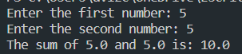
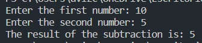
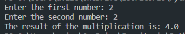
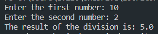

# Calculator

In this section, you will find programs that perform different mathematical operations:

<ol>
    <li>Addition</li>
    <li>Subtraction</li>
    <li>Multiplication</li>
    <li>Division</li>
    <li>Simple Calculator</li>
    <li>Complex Calculator</li>
</ol>

## 1-Sum.py

This program prompts you to enter two numbers, and it will display the sum of those numbers.

## 2-Subtract.py

This program prompts you to enter two numbers, and it will display the subtraction of those numbers.

## 3-Multiply.py

This program prompts you to enter two numbers, and it will display the multiplication of those numbers.

## 4-Divide.py

This program prompts you to enter two numbers, and it will display the division of those numbers.

