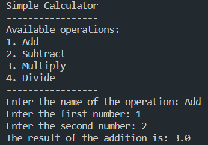
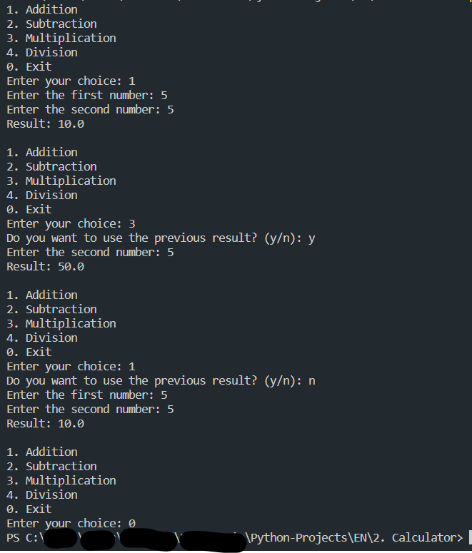

# Calculator

In this section, you will find programs that perform different mathematical operations:

<ol>
    <li>Addition</li>
    <li>Subtraction</li>
    <li>Multiplication</li>
    <li>Division</li>
    <li>Simple Calculator</li>
    <li>Complex Calculator</li>
</ol>

## 1-Sum.py

This program prompts you to enter two numbers, and it will display the sum of those numbers.

## 2-Subtract.py

This program prompts you to enter two numbers, and it will display the subtraction of those numbers.

## 3-Multiply.py

This program prompts you to enter two numbers, and it will display the multiplication of those numbers.

## 4-Divide.py

This program prompts you to enter two numbers, and it will display the division of those numbers.

## 5-SimpleCalculator.py

This program represents a combination of the previous 4 programs, creating a user interface that presents the instructions for the user to follow in order to perform the desired operation.

## 6-ComplexCalculator.py

This program consists of a complex calculator in the terminal, where you can perform any of the 4 arithmetic operations mentioned before (Addition, Subtraction, Division, and Multiplication), with the option to save the result of the previous operation and use it for a new operation; it also allows an option to start from scratch and not continue with the result, and includes an option to exit the program.

