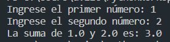
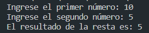
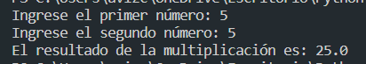
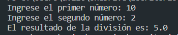
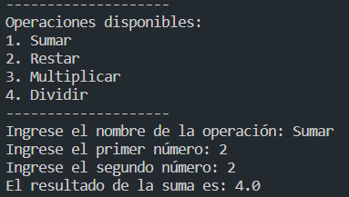
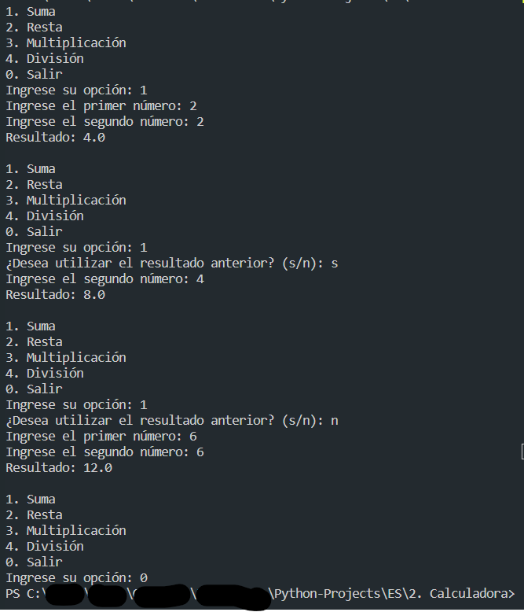

# Calculadora

En este apartado, encontraras unos programas que realizan distintas operaciones matematicas:

<ol>
  <li>Suma</li>
  <li>Resta</li>
  <li>Multiplicación</li>
  <li>División</li>
  <li>Calculadora sencilla</li>
  <li>Calculadora compleja</li>
</ol>

## 1-Suma.py

Este programa te solicita que ingreses dos números, al hacerlo te mostrará la suma de dichos números.

## 2-Resta.py

Este programa te solicita que ingreses dos números, al hacerlo te mostrará la resta de dichos números.

## 3-Multiplicacion.py

Este programa te solicita que ingreses dos números, al hacerlo te mostrará la multiplicación de dichos números.

## 4-Division.py

Este programa te solicita que ingreses dos números, al hacerlo te mostrará la divisin de dichos números.

## 5-CalculadoraSencilla.py

Este programa representa una unión entre los anteriores 4 programas, creando una interfaz de usuario en la que plantea las instrucciones que el usuario debe seguir para realizar la operación que desee realizar.

## 6-CalculadoraCompleja.py

Este programa consiste en una calculadora compleja en la terminal, en la que se puede realizar cualquier de las 4 operaciones aritmeticas antes vistas (Suma,Resta,División y Multiplicación), con la posibilidad de guardar el resultado de la anterior operación y utilizarlo para una nueva operación; también se permite una opción para no continuar con el resultado y empezar desde cero, también se agrega la opción de salir del programa.

