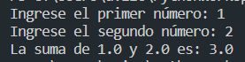
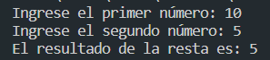
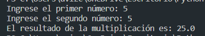

# Calculadora

En este apartado, encontraras unos programas que realizan distintas operaciones matematicas:

<ol>
  <li>Suma</li>
  <li>Resta</li>
  <li>Multiplicación</li>
  <li>División</li>
  <li>Calculadora sencilla</li>
  <li>Calculadora compleja</li>
</ol>

## Suma.py

Este programa te solicita que ingreses dos números, al hacerlo te mostrará la suma de dichos números.

## Resta.py

Este programa te solicita que ingreses dos números, al hacerlo te mostrará la resta de dichos números.

## Multiplicacion.py

Este programa te solicita que ingreses dos números, al hacerlo te mostrará la multiplicación de dichos números.

